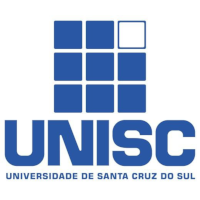

## Sobre

O grupo de usuários de Software Livre Tchelinux, em parceria com a [Universidade de Santa Cruz do Sul](https://www.unisc.br/), tem o prazer de convidar a comunidade para participar do evento que ocorrerá no dia **27 de Abril de 2019 a partir das 8:30h** na UNISC em Santa Cruz do Sul.

## Inscrições

 O evento tem **entrada franca**, porém os participantes são encorajados a doar 2kg de alimentos não perecíveis (exceto sal), que são doados a instituições de caridade da região. Os alimentos são recebidos no momento do credenciamento.

<a href="https://goo.gl/forms/X5E4sfQkFDW2Zx3P2" target="_blank"><b>Clique aqui para fazer sua inscrição!</b></a>

## Certificados

Serão fornecidos certificados digitais para os participantes do evento, que confirmaram sua presença. Para obtê-los, você deverá utilizar o email fornecido na sua inscrição para o evento.

**Importante:** Não esqueça de confirmar sua presença no credenciamento.

## Programação

| 
 Horário 
 | 
 Sala 101   Jogos e Dispositivos Embarcados 
 | 
 Sala 102   Desenvolvimento  
 | 
 Sala 103   SysAdmin e DevOps  
 | 
 Sala 106   Comunidade e Aplicativos
 | 
|:--------------------------:|:-----------------------:|:-----------------------:|:-----------------------:|:-----------------------:|
| **08:30** <td colspan=5>
**Credenciamento**
 |
| **09:00** <td colspan=5>
**Abertura**  Todo o público     Equipe Tchelinux    
 |
| **09:30** | [**Desenvolvendo Jogos com PyGame**](#Desenvolvendo_Jogos_com_PyGame)   Principiante   Rafael Jeffman | [**Introdução ao Spring Boot MVC no Java Servlet Stack com a aplicação Pet Clinic**](#Introdução_ao_Spring_Boot_MVC_no_Java_Servlet_Stack_com_a_aplicação_Pet_Clinic)   Principiante   Marco Mangan | [**Monitoramento com Zabbix**](#Monitoramento_com_Zabbix)   Principiante   Daniel Lara | [**Moodle: Muito mais que o "site da escola"**](#Moodle:_Muito_mais_que_o_"site_da_escola")   Principiante   Alan Velasques Santos |
| **10:20** | [**Godot: A Engine de Jogos que você sempre esperou!**](#Godot:_A_engine_de_jogos_que_você_sempre_esperou!)   Intermediário   Guilherme Henrique Teixeira de Oliveira |  [**Desenvolvimento de um software para a migração entre SGDBs**](#Desenvolvimento_de_um_software_para_a_migração_entre_SGDBs)   Principiante   Nairo Andre Jesus Sanches   Thiago Schoeninger  | [**Entendendo o Systemd**](#Entendendo_o_Systemd)   Principiante   João Avelino Bellomo Filho | [**Projetando seu PCB com o Kicad**](#Projetando_seu_PCB_com_o_Kicad)   Principiante   Augusto Gouvêa Weber |
| **11:10** | [**Introdução ao Arduino**](#Introdução_ao_Arduino)   Principiante   Renato Severo | [**Boas práticas e ferramentas para um time que desenvolve para Núvem - A experiência do QuantoSobra**](#Boas_práticas_e_ferramentas_para_um_time_que_desenvolve_para_Núvem_-_A_experiência_do_QuantoSobra)   Principiante   Vinicius Souza | [**DevOps para sistemas embarcados**](#DevOps_para_sistemas_embarcados)   Intermediário   Eduardo Witter   Diego Cardoso Garcia | [**Pwned! Meu site foi invadido, e agora?**](#Pwned!_Meu_site_foi_invadido,_e_agora?)   Intermediário   Fabio Beneditto |
| **12:00** <td colspan=5>
**Intervalo para Almoço**
 |
| **13:30** | [**DIY: Joystick arcade com Arduino**](#DIY:_Joystick_arcade_com_Arduino)   Intermediário   Alex Veloso da Silveira | [**Uma Não-Gentil Introdução ao Stream Processing**](#Uma_Não-Gentil_Introdução_ao_Stream_Processing)   Intermediário   Julio Biason | [**NGiNX - O motor da sua aplicação Web**](#NGiNX_-_O_motor_da_sua_aplicação_Web)   Intermediário   Ernani Azevedo | [**Inovações no mundo das distribuições Linux**](#Inovações_no_mundo_das_distribuições_Linux)   Principiante   Victor Hugo Aguiar Pacce |
| **14:20** | [**Linux, Raspberry Pi e IoT**](#Linux,_Raspberry_Pi_e_IoT)   Intermediário   Ricardo da Silva Ogliari | [**Por que a galinha atravessou a rua?**](#Por_que_a_galinha_atravessou_a_rua?)   Principiante   Alan Mussoi | [**DevOps: Passado, presente e futuro**](#DevOps:_Passado,_presente_e_futuro)   Intermediário   Cristiano Diedrich |  [**10 anos de cerv.. cafés depois do Santa Cruz do Sul 25/04/2009**](#10_anos_de_cerv.._cafés_depois_do_Santa_Cruz_do_Sul_25-04-2009)   Principiante   Luiz Henrique Rauber Rodrigues |
| **15:10** | [**Uma introdução a teste de software em sistemas embarcados**](#Uma_introdução_a_teste_de_software_em_sistemas_embarcados)   Principiante   Luana de Freitas | [**Web apps em qualquer lugar - 12 Factor App**](#Web_apps_em_qualquer_lugar_-_12_Factor_App)   Intermediário   Tonin Bolzan | [**Iniciando com Kubernetes**](#Iniciando_com_Kubernetes)   Intermediário   Cristhian Bicca  | [**Software Livre no serviço Público**](#Software_Livre_no_serviço_Público)   Principiante   Pablo de Andrades Lima |
| **16:00** <td colspan=5>
**Coffee-Break**
 |
| **16:30** <td colspan=5>
**Encerramento**  Todo o público     Equipe Tchelinux    
 |

## Palestras

### Desenvolvendo Jogos com PyGame

Jogar todo mundo joga. Programar, todo mundo pode. Jogar todo mundo treina. Programar, nem tanto. Mas para jogar é necessário que alguém desenvolva suas habilidades de programador. Nesse bate papo, porque ninguém mais tem paciência para palestras, será apresentada uma forma divertida de desenvolver a programação e conhecer a linguagem Python, construindo jogos, utilizando a biblioteca Pygame e ferramentas open source para desenvolver um jogo.

### Rafael Jeffman

[Rafael Jeffman](https://github.com/rafasgj) é fotógrafo, impressor e professor universitário. Leciona as disciplinas de algoritmos, estruturas de dados e desenvolvimento de jogos. Colaborou por anos com a distribuição GoboLinux. Entre seu projetos atuais, está um sistema de gerenciamento de ativos digitais multiplataforma, open source.

### Introdução ao Spring Boot MVC no Java Servlet Stack com a aplicação Pet Clinic

Uma aplicação Web é um sistema distribuído de alta complexidade. Diversos frameworks de aplicação foram propostos para simplificar a tarefa de desenvolver esse tipo de aplicação. O Spring é um dos frameworks mais influentes dentro e fora do ecossistema Java. Sua implementação em código aberto adota conceitos inovadores como programação orientada a aspectos, programação por convenção e injeção de dependências.  Além disso, o framework incentiva e divulga práticas como teste e compilação automáticos. A aplicação Spring Pet Clinic é um arquétipo que apresenta diversas soluções para compor uma aplicação Web contemporânea. A palestra é dirigida para iniciantes. Serão apresentados conceitos de programação e comentados guias selecionados disponíveis no site da spring.io. Ao final da palestra o participante deve ser capaz de compreender, implantar e alterar o código da aplicação Pet Clinic. 

### Marcos Mangan

[Marco Aurélio Souza Mangan](https://github.com/masmangan) é Graduado (1995) e Mestre (1998) em Ciência da Computação pelo Instituto de Informática/UFRGS e doutorado em Engenharia de Sistemas e Computação pelo PESC/UFRJ (2006). Atualmente é professor da Escola Politécnica/PUCRS. Os principais interesses são ensino, teoria e prática de desenvolvimento de software.

### Monitoramento com Zabbix

Apresentação sobre como o Zabbix funciona e como essa fabulosa ferramenta pode nos ajudar no dia a dia.

### Daniel Lara

[Daniel Lara](https://twitter.com/danniellara) trabalha como Sysadmin e nas horas de folgas contribui com o Projeto Fedora.

### Moodle: Muito mais que o "site da escola" 

Quando falamos em Moodle a primeira coisa que vem na cabeça é: "já usei na faculdade, é ruim!". Mas o que você não sabe é que... o Moodle é muito mais que um ambiente para auxílio a aprendizagem (AVA), ele é um software livre voltado à educação que conta com uma das maiores e mais ativas comunidades de desenvolvedores no mundo todo. Na palestra irei falar sobre como utilizamos o Moodle em minha empresa para os mais diversos projetos voltados a educação, e também como você pode começar a se engajar na comunidade e iniciar a desenvolver para esse AVA incrivelmente poderoso.

### Alan Velasques Santos

[Alan Velasques Santos](https://www.linkedin.com/in/alan-velasques-santos-55222439/) é desenvolvedor PHP a mais de 10 anos, hoje é sócio e CTO da Cognitiva Brasil, empresa de tecnologia voltada ao desenvolvimento de softwares para educação. A Cognitiva trabalha com Moodle para clientes como o Bigbluebuttonbn que é o maior plugin de moodle na atualidade e tem sede no Canadá, projeto MOOBI da UFSC que trabalha com Moodle acessível para surdos e, dentre outros, o Gymine que é uma das duas maiores escolas de cirurgia minimamente invasiva no Brasil.

### Godot: A engine de jogos que você sempre esperou!

Apresentação da engine (história, features, etc..), histórias da vida real e uma sessão de live code 

### Guilherme Henrique Teixeira de Oliveira

[Guilherme Henrique Teixeira de Oliveira](https://github.com/guilhermehto) é desenvolvedor de jogos e criador de conteúdo educacional com foco em FOSS.

### Desenvolvimento de um software para a migração entre SGDBs

Temos como um dos SGBDs mais populares atualmente o MySQL, sendo um software livre de excelente desempenho e estabilidade, em função disso, ele é muito comumente escolhido por empresas de pequeno e médio porte. Porém, o MySQL possui suas limitações, principalmente referindo-se à capacidade gerenciamento do banco e, por isso, com o crescimento de uma empresa, ele pode passar a não suprir mais todas as necessidades que vão surgindo e, por consequência, muitas vezes acaba por ser necessária a migração para um SGBD mais robusto.

### Nairo Andre Jesus Sanches

Nairo Andre Jesus Sanches é professor no SENAC e atua a mais de 20 anos na área da Tecnologia da Informação. É Licenciado em Informática e Mestre em Sistemas e Processos Industriais pela UNISC.

### Thiago Schoeninger

[Thiago Schoeninger](https://www.facebook.com/thiago.schoeninger) é aluno do curso Técnico do SENAC de Santa Cruz do Sul.

### Entendendo o Systemd

O Systemd é o software hoje utilizado pela maioria das distribuições Linux para a inicialização do sistema. Ele apresenta uma infinidade de melhorias em relação aos sofwares anteriores e, ao mesmo, tempo apresenta uma série de novos desafios. Essa apresentação visa identificar os pontos chave dele, enfatizando a nova forma de visualizar o funcionamento da inicialização, bem como mostrar algumas das ferramentas complementares a ele.

### João Avelino Bellomo Filho

[João Avelino Bellomo Filho](https://www.linkedin.com/in/jo%C3%A3o-avelino-bellomo-filho-0b2229a/) é usuário de Fedora Linux. Tecnólogo em Processamento de Dados pela Universidade Católica de Pelotas, Mestre em Ciência da Computação pela Universidade Federal do Rio Grande do Sul. Atualmente é Desenvolvedor na Azion Technologies.

### Projetando seu PCB com o Kicad

Será apresentada a ferramenta de criação de PCBs Kicad e algumas de suas funcionalidades. Durante a palestra será demonstrado os passos para a criação da placa, a escolha dos componentes, a realização do esquemático, do layout e como gerar os arquivos para mandar fabricar. 

### Augusto Gouvêa Weber

[Augusto Gouvêa Weber](https://www.linkedin.com/in/augusto-weber-35b0087b) é Engenheiro recém formado atuando no desenvolvimento de placas para a SMDH e por hobby. 

### Introdução ao Arduino

Arduino é uma plataforma de hardware e software abertos. Criada com o intuito de agilizar a prototipação de projetos eletrônicos, facilitando o aprendizado de eletrônica e software. O objetivo da palestra é apresentar a plataforma Arduino e o seu ecossistema. Passando pelas etapas necessárias para desenvolvimento de um aplicação.

### Renato Severo

[Renato Severo](https://linkedin.com/in/renatossevero/) é Engenheiro de Computação pela Unipampa Bagé. Especialista em Sistemas Embarcados pela UERGS Guaíba. Desenvolvedor de Sistemas Embarcados na DATACOM em Eldorado do Sul.

### Boas práticas e ferramentas para um time que desenvolve para Núvem - A experiência do QuantoSobra

Apanhado geral sobre a estruturação de um time e práticas aplicadas, passando por metodologias ágeis, SCM, Peer Review, automação de testes, CI/CD, Infrastructure as a Code, Frameworks e lições da AWS.

### Vinicius Souza

[Vinicius Souza](https://br.linkedin.com/in/viniciusmartinsdesouza/en) é graduado em Ciência da Computação e trabalha como Desenvolvedor na QuantoSobra.

### DevOps para sistemas embarcados

Nessa palestra, vamos falar sobre softwares embarcados, ver como é feita a entrega contínua deles, considerando a diversidade de plataformas de hardware. Começaremos pela compilação do firmware, passaremos pela automação dos testes e iremos até a disponibilização de uma versão para o cliente. E também sobre as tecnologias usadas no pipeline de entrega contínua, tais como Ansible, Vagrant, Docker, Jenkins, Elasticsearch, como a automação dos testes é feita envolvendo topologias de rede complexas, além da cultura e práticas que possibilitam as entregas frequentes.

### Eduardo Witter

[Eduardo Witter](https://www.linkedin.com/in/eduardo-witter/) é Engenheiro Eletricista e trabalha na Datacom no P&D para Sistemas Embarcados e como DevOps.

### Diego Cardoso Garcia

[Diego Cardoso Garcia](https://www.linkedin.com/in/diego-cardoso-garcia/) é Engenheiro de Computação, especialista em Engenharia de Software, trabalha no P&D como DevOps. 

### Pwned! Meu site foi invadido, e agora?

Todos sabem que a pressa é inimiga da perfeição, mas não adianta deixar aspectos simples de segurança para depois. Veremos como identificar vulnerabilidades de SQL Injection em aplicações PHP, que são encontradas na maioria dos web sites.

### Fabio Beneditto

[Fabio Beneditto](about.me/fabiobeneditto) é Desenvolvedor Web, Old School Nerd, simpatizante de F/OSS, segurança da informação e comunidades em geral. Voluntário Tchelinux desde 2016, e praticante de #mototerapia.

### Como ter sucesso com software livre?

Ao longo de sua vida, quantas vezes você sentiu que havia conquistado o sucesso?  Agora pense, quantas vezes você pensou em desistir?  O objetivo dessa apresentação é trazer uma reflexão sobre o que é sucesso realmente e onde software livre pode ajudar você nessa caminhada.

### Cristiano Diedrich

[Cristiano Diedrich](https://www.mundodocker.com.br) é entusiasta Open Source, se meu principal foco é ir atrás de ideias novas e torna-las realidade através de soluções simples e eficientes. É organizador do Meetup Docker Porto Alegre, Meetup DevOps/SRE Porto Alegre e DevOpsDays Porto Alegre.

### DIY: Joystick arcade com Arduino

A ideia da apresentação é mostrar o desenvolvimento de uma aplicação direta com o Arduino, abordando o mapeamento de um joystick com o dispositivo.

### Alex Veloso da Silveira

[Alex Veloso da Silveira](https://www.facebook.com/alex.veloso.7) é gremista, cervejeiro, gamer, comentarista de comentários de facebook, evangelista de séries no Netflix e nas horas vagas atua como desenvolvedor de software embarcado.

### Uma Não-Gentil Introdução ao Stream Processing

"Big data" está em voga nesses tempos, mas manter os dados fáceis de serem lidos por vários sistemas e que estejam com seus dados atualizados é algo que o stream processing se propôs a resolver. Veremos desde o começo dos tempos com batch processing e o conhecimento adquirido de programação funcional até chegarmos em stream processing.

### Julio Biason

[Julio Biason](https://functional.cafe/@juliobiason) é programa computadores desde os 12 anos.

### NGiNX - O motor da sua aplicação Web

Como utilizar o proxy reverso NGiNX (http://nginx.org/) como servidor web para aplicações de alta performance, permitindo a clusterização dos servidores de aplicação (PHP, Python, Ruby, etc), gerenciamento de sessões em memória, utilizando o Memcache e técnicas para otimização de performance (rede e processamento).

### Ernani Azevedo

[Ernani Azevedo](https://github.com/ernaniaz) é Analista de TI com foco em DevOps, especializado em infra estrutura de redes, servidores UNIX, desenvolvimento de software, telefonia VoIP e aplicações de grande carga. Usuário de UNIX e usuário de Linux desde as primeiras versões, grande paixão por segurança de sistemas e redes e otimização de protocolos e sistemas.

### Inovações no mundo das distribuições Linux

Nesta palestra teremos uma visão geral das distribuições Linux, quais estão inovando e para o lado que as coisas estão andando.

### Victor Hugo Aguiar Pacce

[Victor Hugo Aguiar Pacce](https://github.com/drakonis) cursa Ciência da Computação pela Universidade de Santa Cruz do Sul.

### Linux, Raspberry Pi e IoT

O Objetivo da palestra é mostrar como é fácil instalar e configurar um sistema operacional Linux em um mini-PC Raspberry Pi. Além disso, irei analisar a API para integrar com Internet das Coisas, demonstrações que é possível ser feito.

### Ricardo da Silva Ogliari

[Ricardo da Silva Ogliari](https://www.linkedin.com/in/ricardoogliari/) é Bacharel em Ciência da Computação pela UPF. Especialista em Web: Estratégias de Inovação e Tecnologia pelo Senac-SP. MBA em Desenvolvimento de Jogos e Aplicativos Móveis, pela FIAP. Desenvolvedor Android na Kanamobi. Instrutor na Mobi Learn. Co-autor do livro Android: do Básico ao Avançado. Palestrante em eventos nacionais e internacionais, como FISL, Campus Party, TDC, Intercon e QCon.

### Por que a galinha atravessou a rua?

Nessa palestra desenvolveremos um ambiente semelhante ao clássico jogo Freeway, do Atari2600 (onde objetivo do jogador é levar uma galinha até o outro lado de uma movimentada rodovia), e aplicaremos um algoritmo de inteligência artificial para que nossas galinhas aprendam sozinhas a atravessar a rua. Ao final da palestra os espectadores terão aprendido conceitos básicos da biblioteca pygame, de inteligência artificial, e principalmente, saberão a resposta para a pergunta que dá título à palestra.

### Alan Mussoi

[Alan Mussoi](https://www.linkedin.com/in/alanmussoi/) é Analista de Sistemas e estudante de Matemática Computacional. Entusiasta de Ciência e Tecnologia. Possuí grande interesse por assuntos relacionados a modelos matemáticos, jogos, simuladores e inteligência artificial.

### DevOps: Passado, presente e futuro

A vida de quem trabalha com tecnologia muda constantemente, a cada dia surgem mais e mais soluções, metodologias e formas de melhorar o nosso trabalho. DevOps é um dos diversos termos que se destacam nos últimos anos, então nada melhor do que conversarmos um pouco sobre ele, entender como ele pode ajudar as empresas atualmente e pensarmos juntos em como será não só DevOps mas sim, nossa vida com DevOps.

### Cristiano Diedrich

[Cristiano Diedrich](https://www.mundodocker.com.br) é entusiasta Open Source, se meu principal foco é ir atrás de ideias novas e torna-las realidade através de soluções simples e eficientes. É organizador do Meetup Docker Porto Alegre, Meetup DevOps/SRE Porto Alegre e DevOpsDays Porto Alegre.

### 10 anos de cerv.. cafés depois do Santa Cruz do Sul 25-04-2009

Puxa uma cadeira que o teu velho tio vai te contar uma história que começou aqui nesta cidade lá em 2009... mas claro que rapidamente pq ninguém tem tempo a perder. Muitas tecnologias e principalmente coisas chutáveis evoluiram muito desde lá e sem saudosismo, passarei um pouco do retrospecto de 10 anos junto ao Grupo Tchelinux e ao Software Livre, e sobre assuntos pra nossa área de TI que creio ser tendências,  desafios, boas ou ruins, atuais e quem sabe aos próximos 10 anos.

### Luiz Henrique Rauber Rodrigues

[Luiz Henrique Rauber Rodrigues](https://fb.com/luizrauber) é Professor e pesquisador em assuntos relacionados a tecnologias de software e hardware livres e ao ecossistema hacker/ maker e de startups. Atua como professor no SENAC Santa Cruz do Sul e in company; Voluntário nos projetos educacionais CodeClubeBrasil.org e JabutiEdu.org e no Grupo Tchelinux.org; Doutorando em Tecnologia Ambiental (UNISC), Mestre em Nanociências (UNIFRA), Especialista em Gerenciamento de Projetos (PUCRS), Bacharel em Ciência da Computação e Técnico em Informática (URI Santiago); Palestras em Campus Party/ Latinoware/ FISL/ FGSL e em eventos locais; Mentorias em Startups Weekends.

### Uma introdução a teste de software em sistemas embarcados

Nesta palestra serão abordados conceitos básicos sobre teste de software e como podem ser aplicados ao desenvolvimento em sistemas embarcados utilizando software livre. 

### Luana de Freitas

[Luana de Freitas](https://github.com/llfreitas) é ouvinte de alguns Podcasts e fã de Star Trek, tropeçou no software livre há mais de 10 anos e desde então tenta contribuir para disseminar a palavra do GNU por aí. Formada em engenharia de computação em 2013 trabalha atualmente com verificação funcional em sistemas integrados na SMDH.

### Web apps em qualquer lugar - 12 Factor App

Construa aplicações web que possam escalar e que não gastem o seu tempo desnecessariamente quando o fizerem. Vou falar sobre os 12 fatores que vão ajudar o seu sistema a suportar a maioria dos sistemas cloud modernos e porque você deveria segui-los.

### Tonin Bolzan

[Tonin Bolzan](https://bolzan.io) é membro ativo da comunidade FOSS, sendo organizador do TcheLinux e DevOpsDays de Santa Maria. Trabalho como CTO na Metrosoft S/A e sou apaixonado por programação desde 2008, atualmente trabalho com Sistemas Web utilizando tecnologias como Linux, Docker, PHP, Python e Go.

### Iniciando com Kubernetes

O objetivo desta apresentação é explicar o que é Kubernetes, como ele funciona, seus principais componentes e realizar a instalação e configuração de uma aplicação simples dentro dele.

### Cristhian Bicca

[Cristhian Bicca](https://www.mundodocker.com.br/) é Entusiasta e praticante da cultura DevOps, acredito que a melhor forma de aprender é compartilhando o conhecimento, então procuro sempre participar de eventos tanto como palestrante como também assistir, quando não estou trabalhando procuro passar o conhecimento através do meu blog.

### Software Livre no serviço Público

Apresentar os impactos e benefícios do uso do software livre na gestão pública, bem como vantagens e desvantagens. 

### Pablo de Andrades Lima

[Pablo de Andrades Lima](www.facebook.com/pablocandiota) é Técnico Regional de TI da Emater e Estudante de Engenharia de Computação da Unipampa Campus Bagé.

## Local

> **Universidade de Santa Cruz do Sul**
> Avenida Independência, 2293
> Universitário
> Santa Cruz do Sul - RS

   <iframe src="https://www.google.com/maps/embed?pb=!1m14!1m8!1m3!1d13863.057955954437!2d-52.438544!3d-29.697607!3m2!1i1024!2i768!4f13.1!3m3!1m2!1s0x0%3A0x5d0e6112ed56e4b7!2sUnisc+University+of+Santa+Cruz+do+Sul!5e0!3m2!1sen!2sbr!4v1553371850444" width="600" height="450" frameborder="0" style="border:0" allowfullscreen></iframe>

## Mapa da UNISC

  

## Apoio

### Institucional

### Patrocínio

### Divulgação

